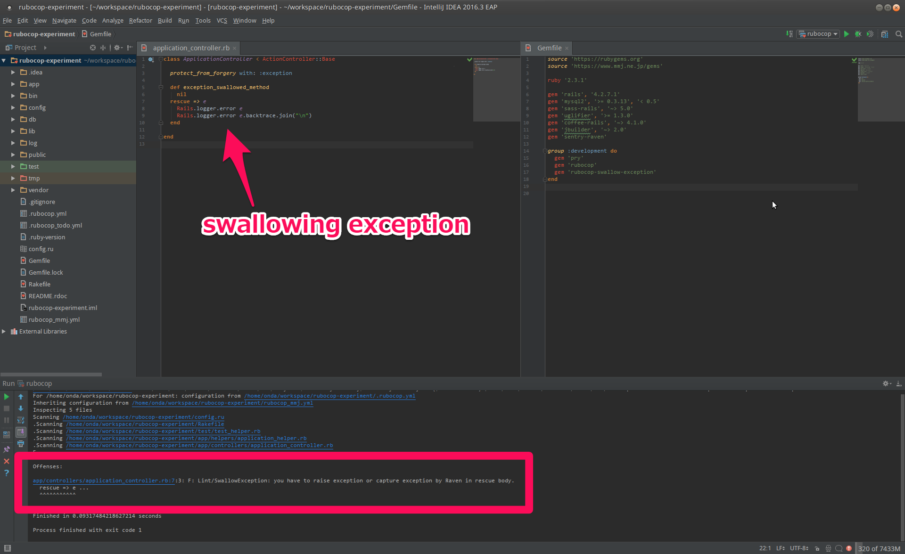

# rubocop-swallow-exception

This is mmj's custom Cop that forbids swallowing exception.
See [imamura's article](https://confluence.mmj.ne.jp/display/HAN/Do+not+swallow+exceptions)
to understand why this Cop is required.


## Installation

Add this line to your application's Gemfile:

```ruby
source 'https://www.mmj.ne.jp/gems
gem 'rubocop-swallow-exception'
```

And then execute:

    $ bundle

Or install it yourself as:

    $ gem install rubocop-swallow-exception

## Usage

Just add require option when you run rubocop.

    $ rubocop --require rubocop-swallow-exception
    



## Specification

The Cop searches rescue body that does not contain raise statement in top level
nor `Raven.capture_exception` ([Sentry](https://sentry.io) client) calling

See spec file below in detail.


```ruby
describe RuboCop::SwallowException do

  subject(:cop) { RuboCop::Cop::Lint::SwallowException.new }

  it 'has a version number' do
    expect(RuboCop::SwallowException::VERSION).not_to be(nil)
  end

  it 'NG when rescue body is empty' do
    inspect_source(cop, <<-EOS)
      def bad_method
        p :hello
      rescue => e
        # do nothing
      end
    EOS
    expect(cop.offenses.size).to eq(1)
    expect(cop.messages.first).to eq('rescue body is empty!')
  end

  it 'OK when raise exception in top level' do
    inspect_source(cop, <<-EOS)
      def bad_method
        p :hello
      rescue => e
        log.error 'error occured'
        log.error e.backtrace.join("\n")
        raise e
      end
    EOS
    expect(cop.offenses.size).to eq(0)
  end

  it "OK when send error to Sentry, by using `Raven.capture_exception'" do
    inspect_source(cop, <<-EOS)
      def bad_method
        p :hello
      rescue => e
        Raven.capture_exception(e)
      end
    EOS
    expect(cop.offenses.size).to eq(0)
  end

  it 'NG when rescue body does not contain raise nor Raven' do
    inspect_source(cop, <<-EOS)
      def bad_method
        p :hello
      rescue => e
        log.error 'error occured'
        log.error e.backtrace.join("\n")
      end
    EOS
    expect(cop.offenses.size).to eq(1)
    expect(cop.messages.first).to match(/you have to/)
  end
end

```


## License

The gem is available as open source under the terms of the [MIT License](http://opensource.org/licenses/MIT).

